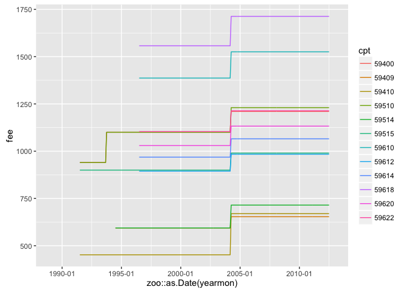

<!-- README.md is generated from README.Rmd. Please edit that file -->
[](https://travis-ci.org/jjchern/csfee)

About
=====

An R data package contains state-year-month level Medicaid birth procedures fees, collected by [Diane Alexander](http://scholar.princeton.edu/dalexand/data-1) for the paper *[Does Physician Compensation Affect Procedure Choice and Patient Health? Evidence from Medicaid C-section Use](http://scholar.princeton.edu/sites/default/files/dalexand/files/procedure_choice_2015.pdf).*

Installation
============

``` r
# install.package("devtools")
devtools::install_github("jjchern/csfee")
```

Usage
=====

``` r
library(dplyr)
csfee::csfee
#> Source: local data frame [186,624 x 7]
#> 
#>      state  usps  yearmon  year month    cpt   fee
#>      (chr) (chr)    (dbl) (dbl) (dbl) (fctr) (dbl)
#> 1  Alabama    AL 1989.000  1989     1  59400    NA
#> 2  Alabama    AL 1989.083  1989     2  59400    NA
#> 3  Alabama    AL 1989.167  1989     3  59400    NA
#> 4  Alabama    AL 1989.250  1989     4  59400    NA
#> 5  Alabama    AL 1989.333  1989     5  59400    NA
#> 6  Alabama    AL 1989.417  1989     6  59400    NA
#> 7  Alabama    AL 1989.500  1989     7  59400    NA
#> 8  Alabama    AL 1989.583  1989     8  59400    NA
#> 9  Alabama    AL 1989.667  1989     9  59400    NA
#> 10 Alabama    AL 1989.750  1989    10  59400    NA
#> ..     ...   ...      ...   ...   ...    ...   ...

library(ggplot2)
csfee::csfee %>%
        filter(usps == "AR") %>%
        ggplot(data = ., aes(x = zoo::as.Date(yearmon), y = fee, colour = cpt)) +
        geom_line() +
        scale_x_date(labels = scales::date_format("%Y-%m"))
```


